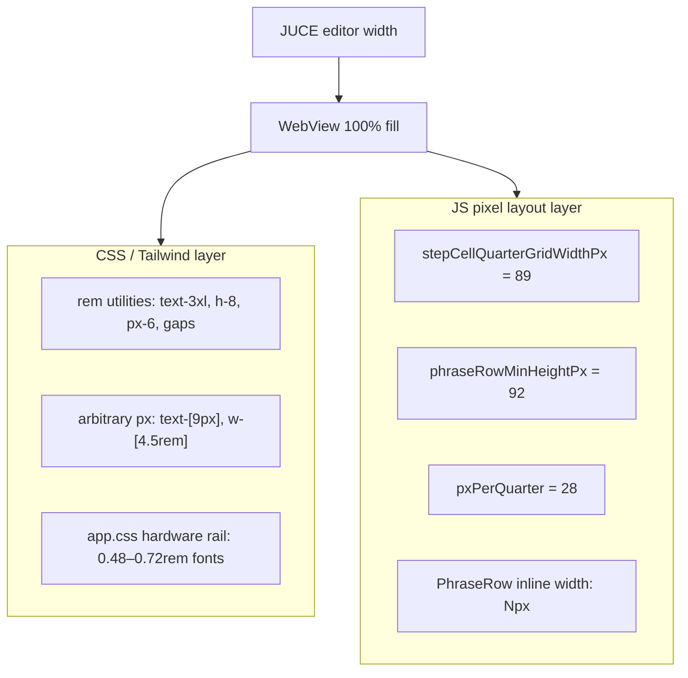

# Smaller-window scaling options for MIDI Phrases WebView UI

## Why it feels boxed in at ~1700px

The UI is effectively **designed at 1670px** (`[source/PluginEditor.cpp](source/PluginEditor.cpp)` `setSize(1670, …)`), but sizing is split across two systems that do not scale together today:




**What already adapts on resize:**

- Vertical flex (`flex-1 min-h-0`) — phrase grid vs piano roll reflow
- Phrase rows **horizontal scroll** when steps exceed width
- Piano roll row height scales 11–16px via `ResizeObserver`

**What stays fixed:**

- Step column width (`89px` per quarter-grid unit in `[ui/src/stepCellLayout.js](ui/src/stepCellLayout.js)`) — sized so a 0.25× cell fits “G#4 127”
- Piano roll horizontal density (`28px`/quarter in `[ui/src/PianoRollPreview.svelte](ui/src/PianoRollPreview.svelte)`)
- Header chrome, combination rail, most control sizes

Shrinking **fonts only** would shrink labels and some Tailwind-sized controls, but step cells and the piano roll would stay wide — the main horizontal pressure would remain.

**JUCE WebView:** There is **no zoom / magnification API** in `[WebBrowserComponent](source/WebViewResourceProvider.cpp)` options today (no `setZoom`, no DPI bridge). The WebView simply fills `getLocalBounds()` on resize. The only cross-layer scaling is hover/cursor coord remapping in `[ui/src/cursor.js](ui/src/cursor.js)`.

---

## Option comparison (for continuous 1000–2000px scaling)


| Approach                          | Effort      | Scales step grid?                   | Scales Tailwind?           | Resize-smooth?     | Main risk                                                 |
| --------------------------------- | ----------- | ----------------------------------- | -------------------------- | ------------------ | --------------------------------------------------------- |
| **A. Unified `uiScale` factor**   | Medium      | Yes (if threaded through layout JS) | Yes (via `html` font-size) | Yes                | Must update layout constants + verify hit-testing/cursor  |
| **B. CSS `zoom` on `html`**       | Low         | Yes                                 | Yes                        | Yes                | Blurry text; non-standard; verify WKWebView + `cursor.js` |
| **C. Viewport meta fixed width**  | Very low    | Yes                                 | Yes                        | Partial (stepwise) | Same blur; less predictable than live resize              |
| **D. Root `font-size` only**      | Low         | No                                  | Yes                        | Yes                | **Inconsistent** — big cells, small labels                |
| **E. Redesign constants smaller** | High        | Yes (at one size)                   | Manual                     | No                 | 1670px may feel sparse; still no continuous scale         |
| **F. Layout reflow / collapse**   | Medium–high | Partial                             | Partial                    | Yes                | Header/rail compaction; more horizontal scroll            |
| **G. Raise min width**            | Trivial     | N/A                                 | N/A                        | N/A                | Doesn’t solve smaller windows                             |


---

## Recommended path: **Option A — unified `uiScale`**

This is the closest analog to **browser zoom + Tailwind rem scaling**, but implemented explicitly because JUCE doesn’t expose zoom.

### Core idea

1. **Design reference width:** `1670` (matches current default editor size).
2. **Compute scale on resize:**
  ```js
   const uiScale = clamp(clientWidth / 1670, 0.62, 1.0);
   // 1000px → ~0.60, 1200px → ~0.72, 1670px → 1.0
  ```
3. **Apply in two places (same factor):**
  - `document.documentElement.style.fontSize =` ${16 * uiScale}px`` — scales all Tailwind `rem` utilities and `app.css` rem sizes
  - Multiply JS layout exports: `stepCellQuarterGridWidthPx`, `pxPerQuarter`, `phraseRowMinHeightPx`, etc.
4. **Optional:** pass `editorWidth` from C++ via existing `withInitialisationData` + update on resize native callback — avoids relying solely on `ResizeObserver`, but `ResizeObserver` on `#app` is sufficient for WebView fill behavior.

### Files to touch


| File                                                                                   | Change                                                                               |
| -------------------------------------------------------------------------------------- | ------------------------------------------------------------------------------------ |
| New `[ui/src/uiScale.js](ui/src/uiScale.js)`                                           | `DESIGN_WIDTH = 1670`, `computeUiScale(width)`, `scaledPx(base)`                     |
| `[ui/src/stepCellLayout.js](ui/src/stepCellLayout.js)`                                 | Export scaled widths (functions or getters, not frozen constants)                    |
| `[ui/src/phraseRowLayout.js](ui/src/phraseRowLayout.js)`                               | Scale row heights / control width assumptions                                        |
| `[ui/src/PianoRollPreview.svelte](ui/src/PianoRollPreview.svelte)`                     | `pxPerQuarter`, keyboard/ruler chrome scale with `uiScale`                           |
| `[ui/src/App.svelte](ui/src/App.svelte)`                                               | `ResizeObserver` → set scale; optional compact header classes below threshold        |
| `[ui/src/main.js](ui/src/main.js)` or `[ui/src/bootstrapUi.js](ui/src/bootstrapUi.js)` | Initialize scale before first paint                                                  |
| `[ui/index.html](ui/index.html)`                                                       | Keep `viewport=device-width` (do **not** switch to fixed viewport for this approach) |


### C++ (optional, small)

- Add native function `setEditorSize(width, height)` called from `PluginEditor::resized()` so scale updates even if WebView internal resize timing is odd.
- Or pass `designWidth: 1670` in init data only (scale entirely JS-side).

### Cursor / hit-testing

`[cursor.js](ui/src/cursor.js)` maps host pixels → `documentElement.clientWidth/Height`. As long as scale changes **layout size** (via `zoom` or real px/font scaling), not `transform: scale()` on a wrapper, `elementFromPoint` and host coord mapping should stay aligned. **Avoid `transform: scale()` on `#app`** without compensating pointer math.

Verify after implementation: drag on step resize handles, piano-roll loop brace, `data-cursor` hover chain.

### Tests

- Extend `[ui/src/stepCellLayout` tests](ui/src/) if any exist, or add a small unit test for `computeUiScale` boundaries
- Manual: 1000, 1200, 1670, 2000px editor widths — step “G#4 127” still readable at min scale (~0.62)

---

## Quick-win alternative: **Option B — CSS `zoom`**

If you want a **1–2 hour experiment** before committing to Option A:

```css
/* app.css — driven by JS custom property */
html { zoom: var(--ui-zoom, 1); }
```

```js
const uiZoom = Math.min(1, clientWidth / 1670);
document.documentElement.style.setProperty('--ui-zoom', String(uiZoom));
```

**Pros:** Scales rem, px, canvas layout, and inline styles uniformly — true “browser zoom” feel.  
**Cons:** Text can look soft below ~0.75; `zoom` is non-standard (but works in WKWebView/WebView2); less explicit than threading scale through layout code; harder to unit-test grid math at fractional scales.

Use this to **validate target readability** at 1000–1200px, then implement Option A if blur or snap-to-grid feel is unacceptable.

---

## Complementary tweaks (low cost, not sufficient alone)

These help density but won’t solve continuous scaling without A or B:

- **Header compaction** below `uiScale < 0.85`: hide “ofsound” subtitle row, shorten `text-3xl` title via scale, tighten `px-6` → `px-4`
- **Accept horizontal scroll** — already works; at small widths users scroll phrase rows (by design)
- **Combination rail** — `[app.css](ui/src/app.css)` uses fixed rem button sizes; benefits from `uiScale` or a dedicated compact mode
- **Min width** — current floor is `1000×480` in `[PluginEditor.cpp](source/PluginEditor.cpp)`; if 1000px at scale 0.6 is unreadable, consider raising min to `1100` or capping scale at `0.65`

---

## What I would not do

- **Font-size only** (Option D) — leaves the 89px step grid untouched; you’ll still feel boxed in horizontally.
- **Fixed viewport meta** (`width=1670`) as the long-term solution — poor fit for continuous resize and DAW window dragging.
- `**transform: scale()` wrapper** without pointer compensation — breaks `[cursor.js](ui/src/cursor.js)` and JUCE hover workarounds.

---

## Suggested implementation sequence

1. **Spike Option B** (`--ui-zoom`) at 1000 / 1200 / 1670 — confirm readability and cursor/drag behavior in standalone.
2. If blur is acceptable → ship B with `ResizeObserver` (minimal diff).
3. If blur is not acceptable → implement **Option A**: central `uiScale.js`, convert layout constants to scaled getters, set root `font-size`, add scale-aware tests.
4. Optional polish: header compaction thresholds, pass editor size from C++ on `resized()`.

